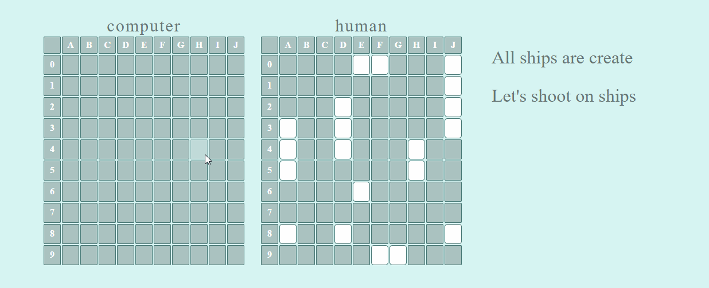
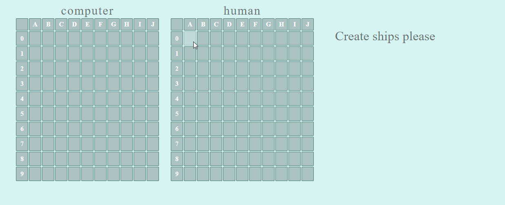
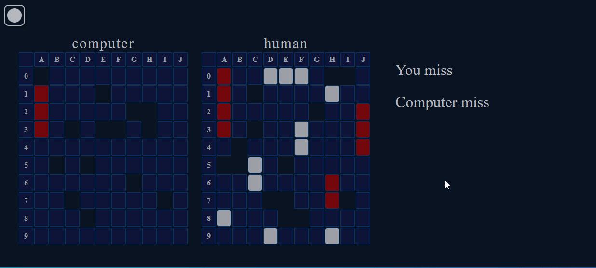

# Sea battle  

_Sea battle is a classic game in which players compete to sink each other's ships on the playing field._

# [View Demo](https://andrewvoloshin.github.io/Sea-Battle-App/) 

## Features:
- Use architectural pattern Model-View-Controller
- Player versus computer play
- Different types of ships (single deck, double deck, etc.)
- Interactive game board
- Three levels of computer difficulty
- Ability to change the theme light/dark
  

## Launching

### Option 1: Open in a browser

1. Clone the repository to your local computer.
2. Open the `index.html` file in your web browser.

### Option 2: Using a local web server

1. Clone the repository to your local computer.
2. Install a local web server, such as [Live Server](https://marketplace.visualstudio.com/items?itemName=ritwickdey.LiveServer).
3. Run the project using the selected local web server.
   
## Demonstration

